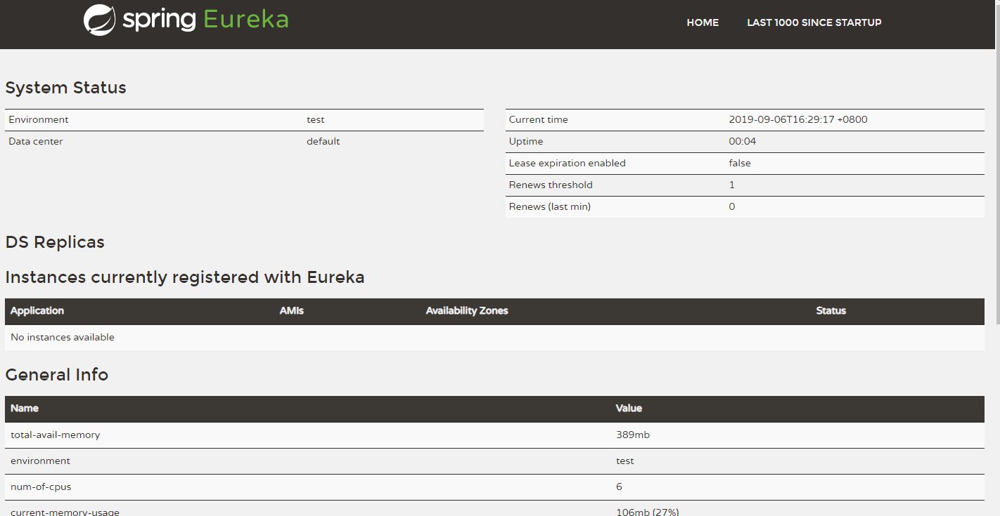
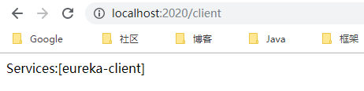
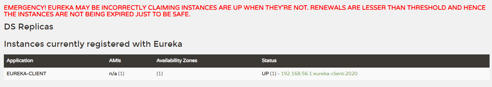
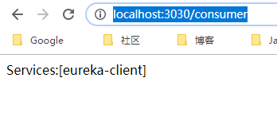
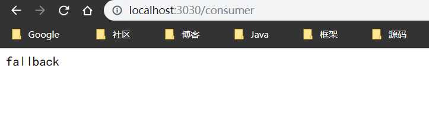
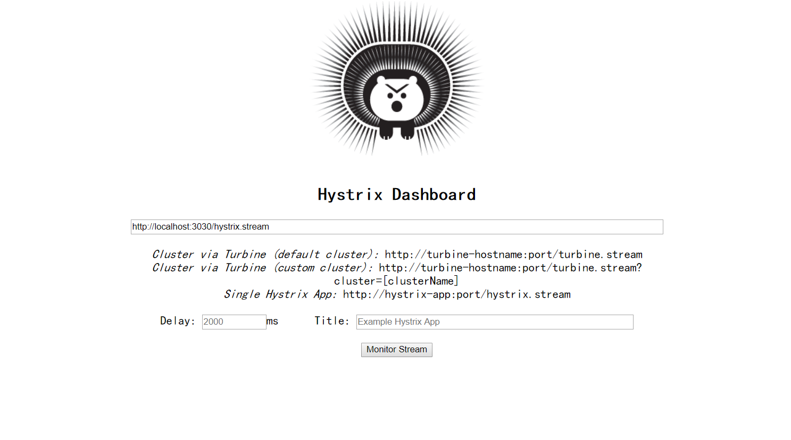
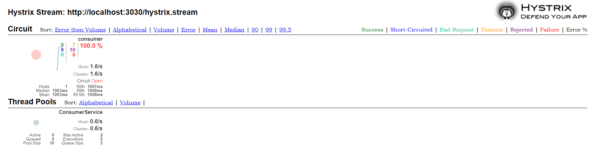
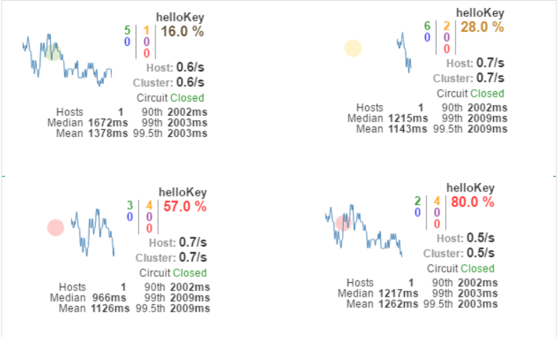
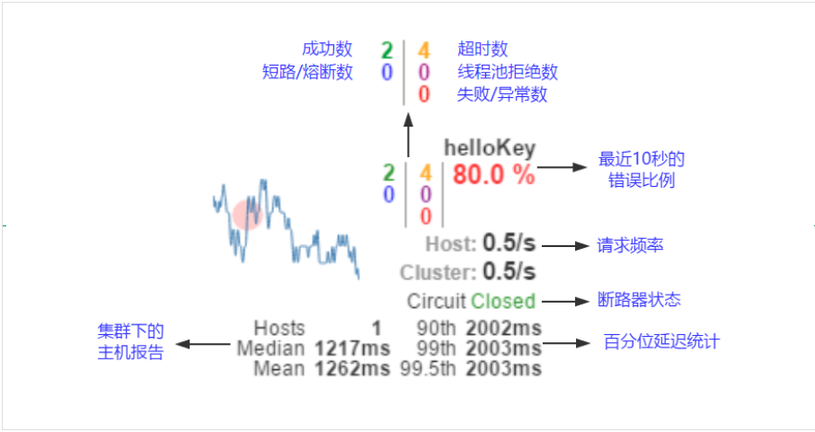

# 1. Spring Cloud 入门
## 1.1. eureka-server
-启动server，访问 http://localhost:1010/，出现如图

- 未启动client端，图中是没有服务的
## 1.2. eureka-client
- 启动client端，访问http://localhost:2020/client
出现如图

- 再次刷新server端，如图，表示服务已经上来
 
## 1.3. eureka-consumer
- 访问http://localhost:3030/consumer

## 1.4. eureka-consumer-ribbon
- 访问http://localhost:3030/consumer

## 1.5. eureka-consumer-feign
- 访问http://localhost:3030/consumer

## 1.6. eureka-consumer-ribbon-hystrix

调用成功。

## 1.7. Hystrix-dashboard
访问：http://localhost:1111/hystrix

点击monitor Stream 之后：

我们可以在监控信息的左上部分找到两个重要的图形信息：一个实心圆和一条曲线。
实心圆：共有两种含义。它通过颜色的变化代表了实例的健康程度，如下图所示，它的健康度从绿色、黄色、橙色、红色递减。该实心圆除了颜色的变化之外，它的大小也会根据实例的请求流量发生变化，流量越大该实心圆就越大。所以通过该实心圆的展示，我们就可以在大量的实例中快速的发现故障实例和高压力实例。

曲线：用来记录2分钟内流量的相对变化，我们可以通过它来观察到流量的上升和下降趋势。
其他一些数量指标如下图所示：

